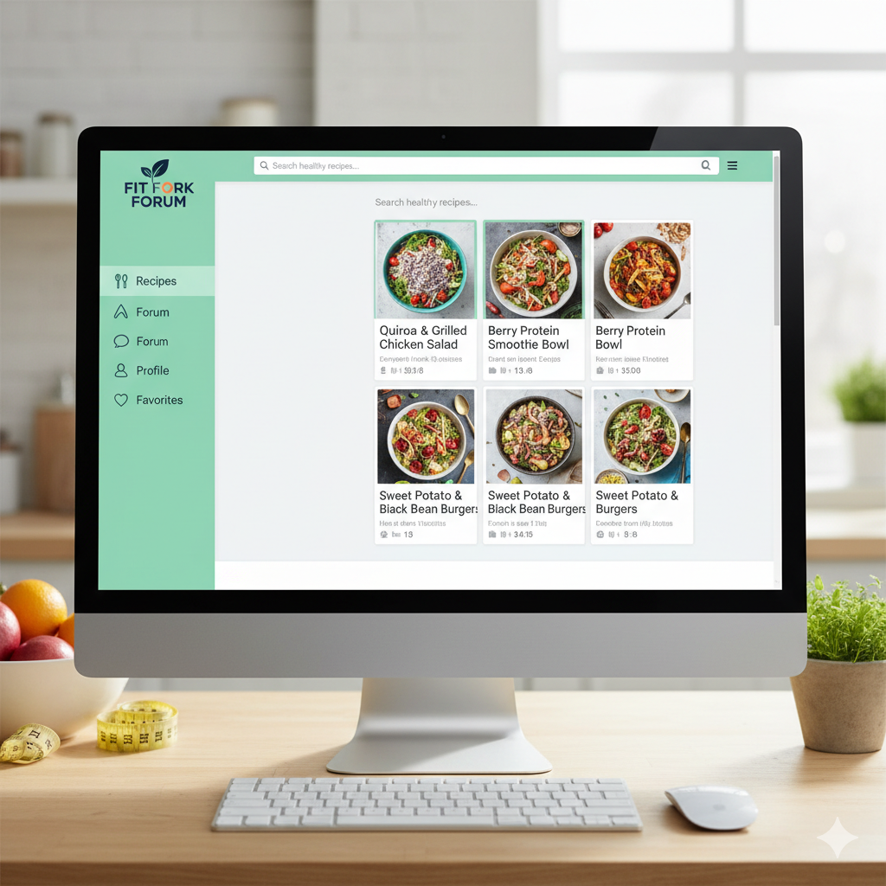

# RecApp - Forum di Ricette Fit

## 🎯 Obiettivo del Progetto
RecApp è una web application forum dedicata alle ricette fitness, progettata con un design moderno ispirato a SaporNet. L'applicazione permette agli utenti di condividere, scoprire e interagire con ricette salutari e adatte a uno stile di vita fitness.

## 🏗️ Architettura del Progetto

### Frontend (React + Vite)
- **Location**: `client/`
- **Framework**: React 18 con Vite
- **Routing**: React Router DOM
- **Styling**: CSS moderno con gradients e animazioni
- **Componenti principali**:
  - `Navbar`: Navigazione principale con logo, search, preferiti
  - `Hero`: Sezione hero con call-to-action
  - `CategoryButtons`: Griglia di categorie (Proteiche, Low Carb, Vegan, etc.)
  - `RecipeCard`: Card per singole ricette con rating, likes, difficoltà

### Backend (Node.js + Express)
- **Location**: `server/`
- **Framework**: Node.js + Express
- **Database**: PostgreSQL con Prisma ORM
- **Caching**: Redis per performance
- **Autenticazione**: JWT + OAuth (Google/GitHub)

### Database Schema
- **Users**: Gestione utenti e profili
- **Recipes**: Ricette con ingredienti, istruzioni, valori nutrizionali
- **Comments**: Sistema di commenti
- **Ratings**: Valutazioni delle ricette
- **Badges**: Sistema gamification

## 🚀 Setup e Avvio

### Prerequisiti
- Node.js 18+
- PostgreSQL 14+
- Docker (opzionale)

### Installazione

#### Metodo 1: Setup Locale
```bash
# Backend
cd server
npm install
npx prisma migrate dev --name init
npm run dev

# Frontend
cd ../client
npm install
npm run dev
```

#### Metodo 2: Docker
```bash
# Avvio completo con Docker Compose
docker-compose up --build
```

### URL di Accesso
- Frontend: http://localhost:5173
- Backend API: http://localhost:3000
- Database: PostgreSQL su porta 5432
- Redis: porta 6379

## 🎨 Design e UI

### Palette Colori
- **Primario**: Orange gradient (#ff6b35 → #ff4500)
- **Sfondo**: Cream/Beige (#ffeee6, #ffe5d9)
- **Testo**: Dark gray (#2d2d2d)
- **Accenti**: Verde per difficulty easy, rosso per hard

### Componenti UI
- **Cards**: Border radius 20px, hover animations
- **Buttons**: Gradient background, shadow effects
- **Typography**: Font weight 800 per titoli, Segoe UI family
- **Responsive**: Grid layout con auto-fit, mobile-first

## 📱 Funzionalità Principali

### ✅ Completate
- [x] Setup progetto con separazione client/server
- [x] Configurazione Docker + PostgreSQL + Redis
- [x] Schema database con Prisma
- [x] Componenti UI base (Navbar, Hero, Categories, RecipeCard)
- [x] Design responsive ispirato a SaporNet
- [x] Sistema di autenticazione pianificato

### 🔄 In Sviluppo
- [ ] React Router per navigazione
- [ ] API REST per ricette
- [ ] Sistema di autenticazione completo
- [ ] Upload immagini ricette
- [ ] Sistema di like/preferiti

### 📋 Da Implementare
- [ ] Pagina dettaglio ricetta
- [ ] Profilo utente
- [ ] Sistema di commenti
- [ ] Search e filtri avanzati
- [ ] Dashboard admin
- [ ] Sistema di notifiche

## 🔧 Tecnologie Utilizzate

### Frontend
- React 18
- Vite 5
- React Router DOM
- CSS3 (Flexbox, Grid, Animations)

### Backend
- Node.js
- Express.js
- Prisma ORM
- PostgreSQL
- Redis
- JWT + Passport.js
- bcryptjs

### DevOps
- Docker & Docker Compose
- Git & GitHub

## 📂 Struttura File

```
RecApp/
├── client/                 # React frontend
│   ├── src/
│   │   ├── components/     # Componenti React
│   │   ├── pages/         # Pagine (da implementare)
│   │   ├── hooks/         # Custom hooks
│   │   └── utils/         # Utilities
│   ├── public/
│   └── package.json
├── server/                # Node.js backend
│   ├── src/
│   │   ├── routes/        # API routes
│   │   ├── models/        # Database models
│   │   ├── middleware/    # Express middleware
│   │   └── config/        # Configurazioni
│   ├── prisma/           # Database schema
│   └── package.json
├── docs/                 # Documentazione
├── docker-compose.yml    # Container orchestration
└── README.md
```

## 🤝 Contributori
- **Sviluppo**: GitHub Copilot AI Assistant
- **Design**: Ispirato a SaporNet
- **Progetto**: RecApp Forum Ricette Fit

## 📝 Note Tecniche
- Database configurato con utente `recapp_user` e database `recapp`
- Redis utilizzato per caching e sessioni
- JWT per autenticazione stateless
- Prisma per ORM type-safe
- Vite per fast development e build ottimizzate

---
Sostituisci i placeholder e personalizza le funzionalità secondo le tue esigenze!
